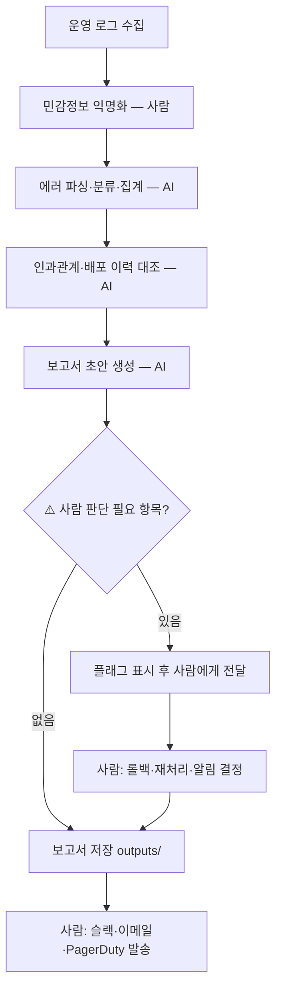

# 업무 순서도 — 에러 로그 추적 자동화

## 1. 한 줄 정의

- 업무명: 에러 로그 추적 자동화
- 최종 산출물: 에러 분류·원인·액션 아이템 보고서 (`outputs/report-YYYYMMDD.md`)
- AI가 맡을 일: 로그 파싱, 에러 분류·집계, 인과관계 추정, 보고서 초안 작성
- 사람이 반드시 확인할 일: 배포 롤백 여부, 데이터 재처리 결정, 보안 위협 판단, 외부 알림 발송

## 2. 단계 목록

| 순서 | 단계 | 입력 | 처리 | 출력 | 담당 |
|---:|---|---|---|---|---|
| 1 | 로그 수집 | 운영 서버 로그 파일 | 민감정보(IP, 사용자ID) 익명화 후 복사 | `golden/input-example.md` | 사람 |
| 2 | 에러 파싱·분류 | 로그 파일 | 에러 유형별 그룹핑, 발생 횟수·시간 집계 | 분류표 초안 | AI |
| 3 | 근본원인 추정 | 분류표 + 로그 패턴 | 인과관계 분석, 배포 이력 대조 | 원인 추정 섹션 | AI |
| 4 | 보고서 초안 생성 | 분류표 + 원인 | 골든 출력 형식으로 보고서 작성 | `outputs/draft-N.md` | AI |
| 5 | 사람 검토 항목 플래그 | 초안 | ⚠️ 항목 식별 및 표시 | 검토 요청 목록 | AI |
| 6 | 최종 판단 | 초안 + 플래그 목록 | 롤백·재처리·알림 여부 결정 | 승인된 보고서 | 사람 |
| 7 | 외부 알림 발송 | 승인된 보고서 | 슬랙·이메일·PagerDuty 전송 | 알림 완료 | 사람 |

## 3. Mermaid 순서도

## 4. AI가 하면 안 되는 단계

- 실제 서버 재시작 / 프로세스 킬
- 코드 수정·커밋·배포
- 슬랙·이메일·PagerDuty 직접 호출
- 배포 롤백 결정 (판단은 AI, 실행은 사람)
- 데이터 재처리 또는 폐기 결정

## 5. 3주차 제약 조건 후보

1. 출력 구조 고정: [분류표 → 근본원인 → 액션 아이템 → ⚠️ 사람 검토 → 한 줄 요약] 5섹션
2. 수치 원본 보존: 발생 횟수·응답시간·버전은 로그 그대로, 반올림·생략 금지
3. 추측 표현 금지: "아마", "것 같다" 대신 "원인 확정 불가 — 사람 확인 필요"
